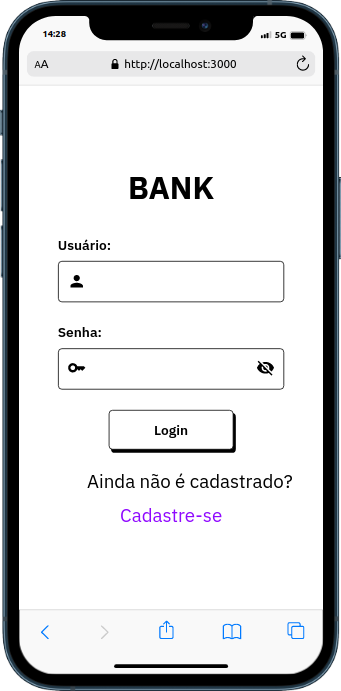
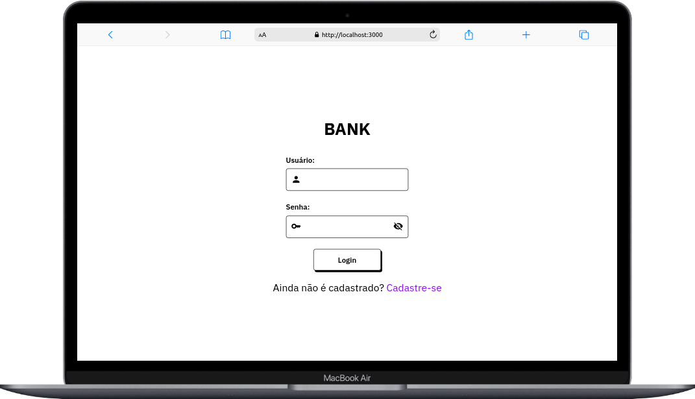
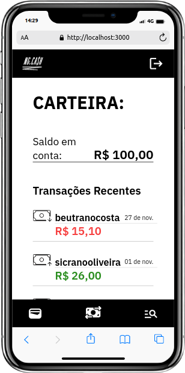
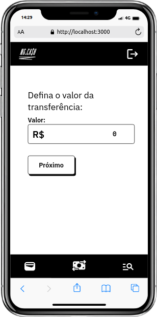
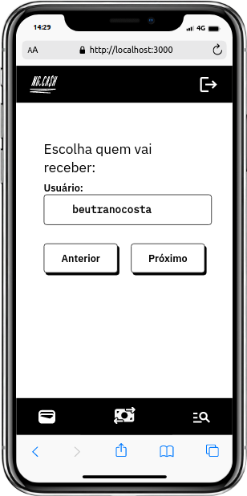
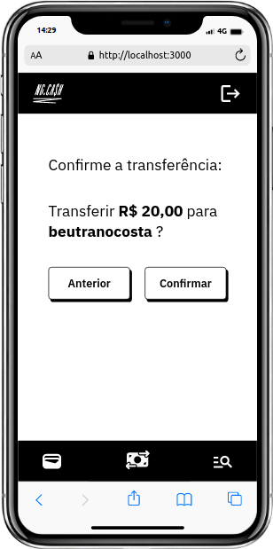
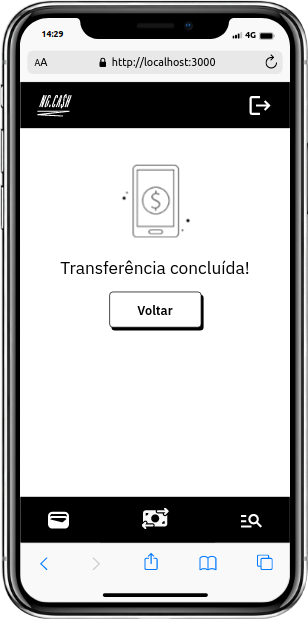

<h1 align="center"> E-Bank 🏦 </h1>

## Sobre

O E-bank é uma aplicação fullstack baseada na proposta de desafio técnico proposto por uma empresa de tecnologia.

## Rodando o projeto

Necessário: Docker e docker-compose

Execute o script de inicialização na pasta raiz:

```bash
npm start 
## o compose na pasta raiz irá iniciar toda a aplicação, com banco, client e api funcionais 
```

> Obs: O script start navega para as pastas client e api e instala suas dependências, em seguida executa o docker-compose presente na raiz do projeto, você pode optar por fazer isso manualmente

Se o compose foi executado corretamente, você pode acessar a aplicação em: <http://localhost:3000/>

<h1 align="center"> E-Bank API </h1>

<div align="center">


 

</div>

## Sobre

API responsável por alimentar o client do projeto, nela é possível manipular as entidades Users, Accounts e Transcactions do banco.

Foi  utilizado a arquitetura MSC para organização da aplicação e o padrão REST para criação da API.

<details>
  <summary>Regras de negócio</summary>
  
- Qualquer pessoa deverá poder fazer parte da aplicação. Para isso, basta realizar o cadastro informando *username* e *password*.
- Deve-se garantir que cada *username* seja único e composto por, pelo menos, 3 caracteres.
- Deve-se garantir que a *password* seja composta por pelo menos 8 caracteres, um número e uma letra maiúscula. Lembre-se que ela deverá ser *hashada* ao ser armazenada no banco.
- Durante o processo de cadastro de um novo usuário, sua respectiva conta deverá ser criada automaticamente na tabela **Accounts** com um *balance* de R$ 100,00. É importante ressaltar que caso ocorra algum problema e o usuário não seja criado,  a tabela **Accounts** não deverá ser afetada.
- Todo usuário deverá conseguir logar na aplicação informando *username* e *password.* Caso o login seja bem-sucedido, um token JWT (com 24h de validade) deverá ser fornecido.
- Todo usuário logado (ou seja, que apresente um token válido) deverá ser capaz de visualizar seu próprio *balance* atual. Um usuário A não pode visualizar o *balance* de um usuário B, por exemplo.
- Todo usuário logado (ou seja, que apresente um token válido) deverá ser capaz de realizar um *cash-out* informando o *username* do usuário que sofrerá o *cash-in*), caso apresente *balance* suficiente para isso. Atente-se ao fato de que um usuário não deverá ter a possibilidade de realizar uma transferência para si mesmo.
- Toda nova transação bem-sucedida deverá ser registrada na tabela **Transactions**. Em casos de falhas transacionais, a tabela **Transactions** não deverá ser afetada.
- Todo usuário logado (ou seja, que apresente um token válido) deverá ser capaz de visualizar as transações financeiras (*cash-out* e *cash-in*) que participou. Caso o usuário não tenha participado de uma determinada transação, ele nunca poderá ter acesso à ela.
- Todo usuário logado (ou seja, que apresente um token válido) deverá ser capaz de filtrar as transações financeiras que participou por:
  - Data de realização da transação e/ou
    - Transações de *cash-out;*
    - Transações de *cash-in.*

</details>

## Tecnologias utilizadas

- TypeScript
- Node.js
- Express.js para criação da API
- Postgres com Sequelize
- Mocha, Chai, chai-http, nyc e Sinon para testes unitários e de integração
- Zod para validação de objetos e tipagem
- JWT e Bcrypt para emcriptação de senhas
- ESLint para assegurar qualidade do código

## Documentação

[Documentação do Postman](https://www.postman.com/cloudy-satellite-23795/workspace/ngcash/request/24296482-d918d55f-9be7-4f8f-8d91-c170c15980bc);

Há dois arquivos thunder-collection.json caso opte por importar a documentação.

## Rodando testes

Na pasta api:

```bash
npm test ## verifica os testes unitários
npm run test:coverage ## verifica a cobertura de testes
npm run test:integration ## testa os testes de integração
```

Outros scripts:

```bash
npm run db:reset ## Reinicia o banco, migration e seeders caso necessário

npm run dev # Inicia a aplicaçao express, caso você já tenha rodado o docker-compose esse comando não irá funcionar
```

> A aplicação está funcionando na porta 3001, caso queira fazer alguma modificação de rota, acesse o docker-compose na raiz do projeto e altere as variáveis de ambiente.

<h1 align="center"> E-Bank Client </h1>

<div align="center">


 

</div>

## Sobre

Aplicação que o usuário pode fazer seu login, visualizar seu saldo em conta e suas transferências, além de poder realizar transfêrencias a outros usuários por meio do seu nome de usuário.
Nesta aplicação, o usuário pode:

- Fazer login ou registrar-se
- Visualizar seu saldo e histórico de transferencias;
- Fazer uma busca por data ou tipo de transferência;
- Fazer uma transfêrencia para outro usuário através do nome de usuário;

## Tecnologias utilizadas

- Vite + React + Typescript
- MUI Icons
- Axios
- React Axe para assegurar acessibilidade das telas;
- Jest
- RTL
- ESLint para assegurar a qualidade do código
- CSS modules
- Mobile first e responsividade

## Telas

### Login

<div align="center">
 

</div>

### Balance

<div align="center">
 

</div>

### Tranfer

<div align="center">





</div>

### History

<div align="center">


</div>

## Rodando a a aplicação

```bash
npm run dev 
## se o compose estiver funcional, não há necessidade de rodar este comando
```

## Rodando testes

```bash
npm test
```
